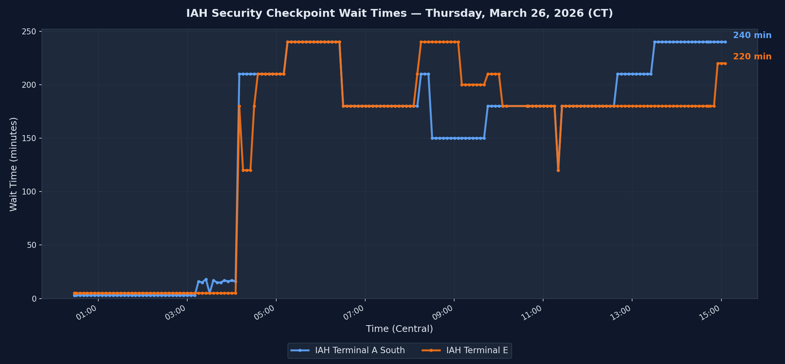

# IAH Security Wait Times

[](https://github.com/adonnell6/iah-wait-times/actions/workflows/fetch.yml)

Automated logging of TSA security checkpoint wait times at George Bush Intercontinental Airport (IAH) in Houston, TX.

A GitHub Actions workflow polls the Houston Airports API every 5 minutes and appends wait times to `iah-wait-times.log`.

## Today's Wait Times



## Log Format

```
2026-03-25 10:37:42  IAH Terminal A South: 45 min  |  IAH Terminal E: 120 min
```

Timestamps are in Pacific Time. All security checkpoints (excluding FIS/customs) are logged. Closed terminals are recorded as `CLOSED`.
